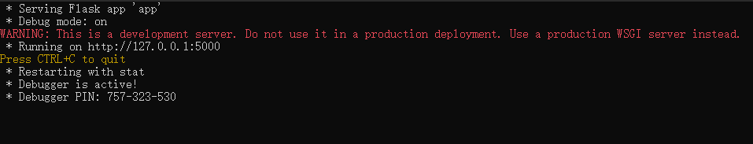
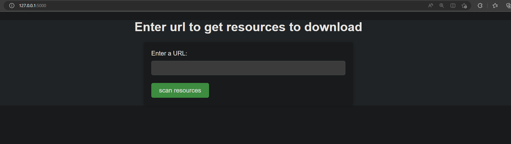

# [download_somthing_from_web](https://github.com/LaplaceFourior/download_somthing_from_web/)

[](LICENSE)
[](https://github.com/RichardLitt/standard-readme)
[](https://www.python.org/downloads/release/python-3100/)

[](https://github.com/pallets/flask)

This is a project that will help you download files from a url

## Table of Contents
- [Install](#install)
- [Usage](#usage)
- [Contributing](#contributing)
- [License](#license)

## Install
You can install the software in two ways:  [source code](#1-for-source-code) or [release one](#2-for-release).

### (1) For Source Code
Before you start to install this project, make sure that you have installed [git](https://git-scm.com/download) in your computer.

use this command to get the source code to your computer:

```
git clone https://github.com/LaplaceFourior/download_somthing_from_web.git
```

You will run this project with source code.
### (2) For Release
You can also download the release version of the software, and run it directly.


## Usage

You can run the software in two ways, [source code](#for-source-code) or [release](#for-release):

### For Source Code:
#### (1) 
This project is based on [Python 3.10](https://www.python.org/downloads/release/python-3100/). Before you start to install, make sure that you have already installed Python 3.10.

#### (2)
If you have already installed Python 3.10, make sure that you can create virtual environment on you computer, After that, you can run this project with:

##### For  Windows
>double click [start.bat](./start.bat)

or

>cd the project root folder, open a cmd and run: 
```
    ./start.bat
```
##### For macos or linux
>cd the project root folder, open a terminal and run: 
```
    ./start.sh
```
the start script will build a venv in the root folder and install the required package with [requirements.txt](./requirements.txt).

#### (3)
Then it will start a web application 



copy the url: http://127.0.0.1:5000/ to a browser and enter.



then enter a url that you want to find resources in it, click scan and wait.

After returning a resources list, you can download which you want.
### For Release:
#### (1)
After you download one release version,
##### for Windows:

double click
>download_something_from_web.exe

in the root folder

or 

cd the root folder and run in cmd
```
    ./download_something_from_web.exe
```
##### for Linux or MacOs:

cd the root folder, make sure the file:
>download_something_from_web

has the permission to run,
and then cd the root folder, in terminal run:
```
    ./download_something_from_web
```
#### (2)
See the [step(3)](#3) above
## Contributing
Thanks for your contribution to download_something_from_web !

<a href="https://github.com/LaplaceFourior/download_somthing_from_web/graphs/contributors">
  
</a>

Made with [contrib.rocks](https://contrib.rocks).
## License

[MIT © Chenchou Yu.](LICENSE)
